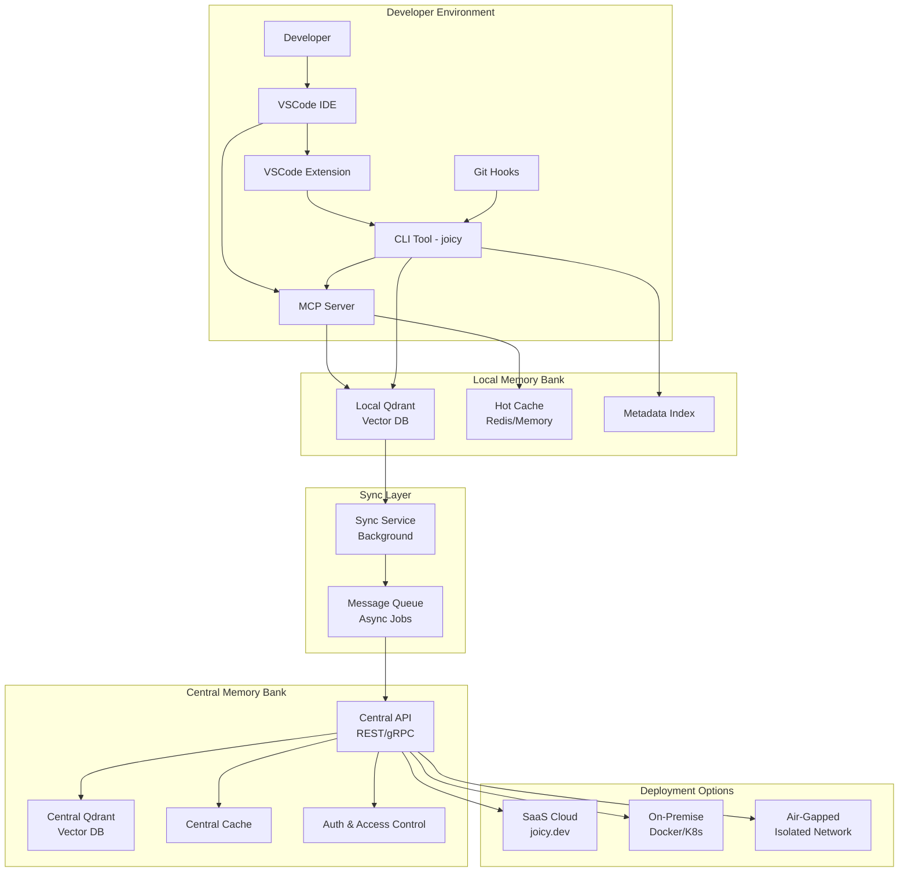
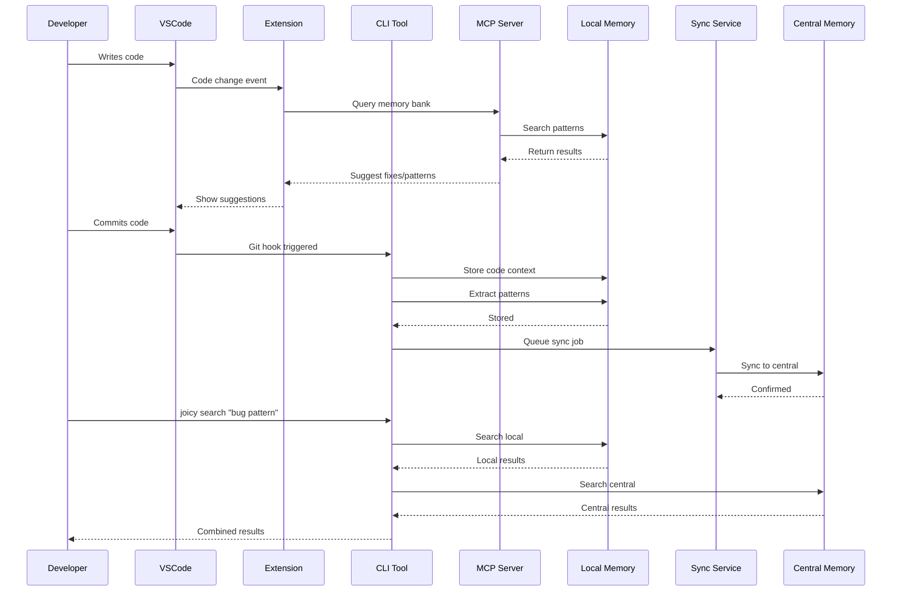
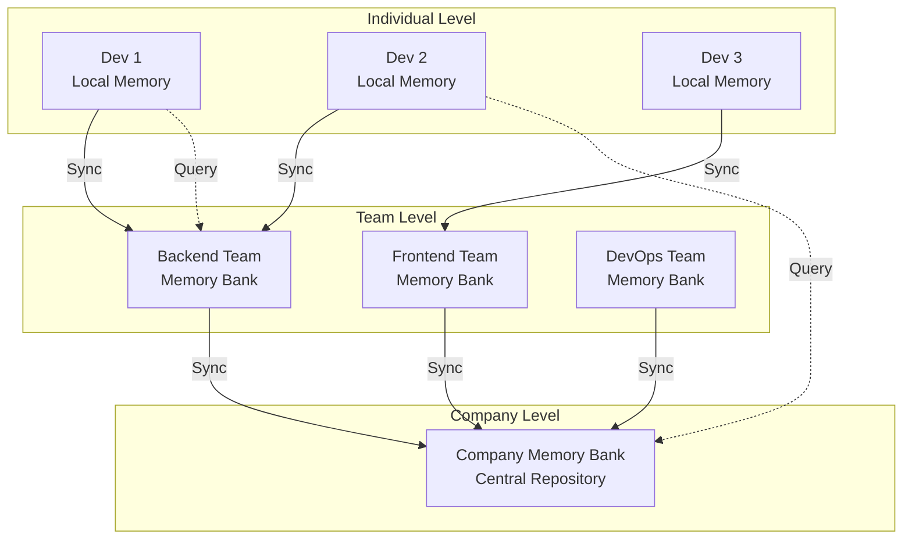
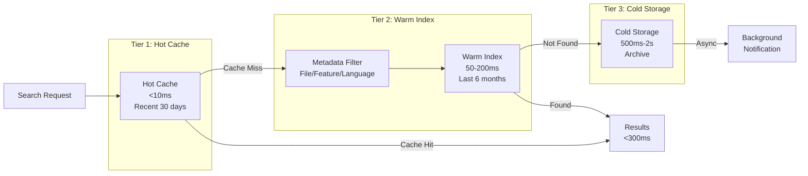
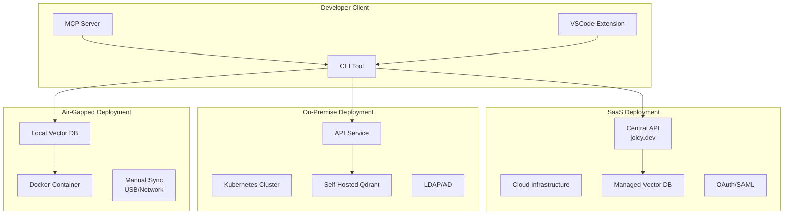
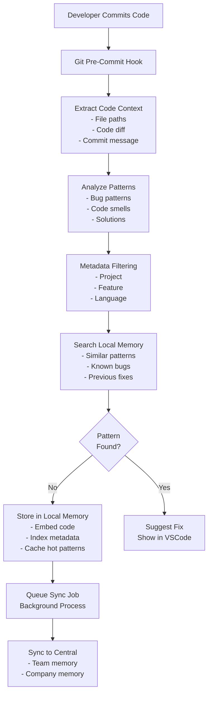
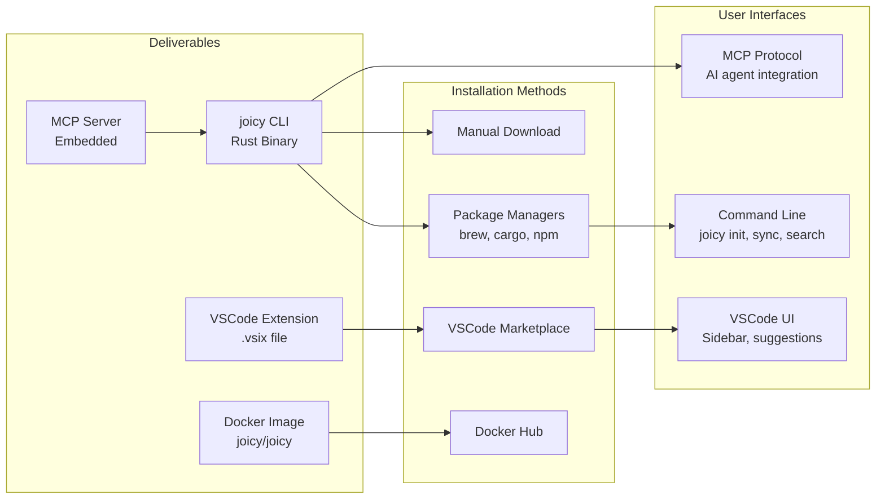
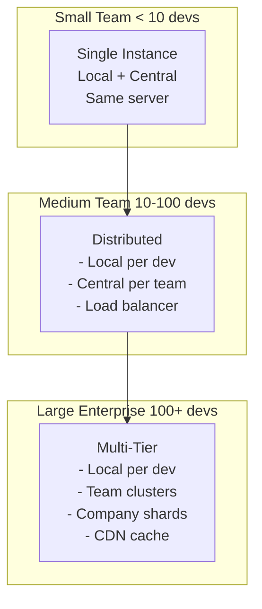
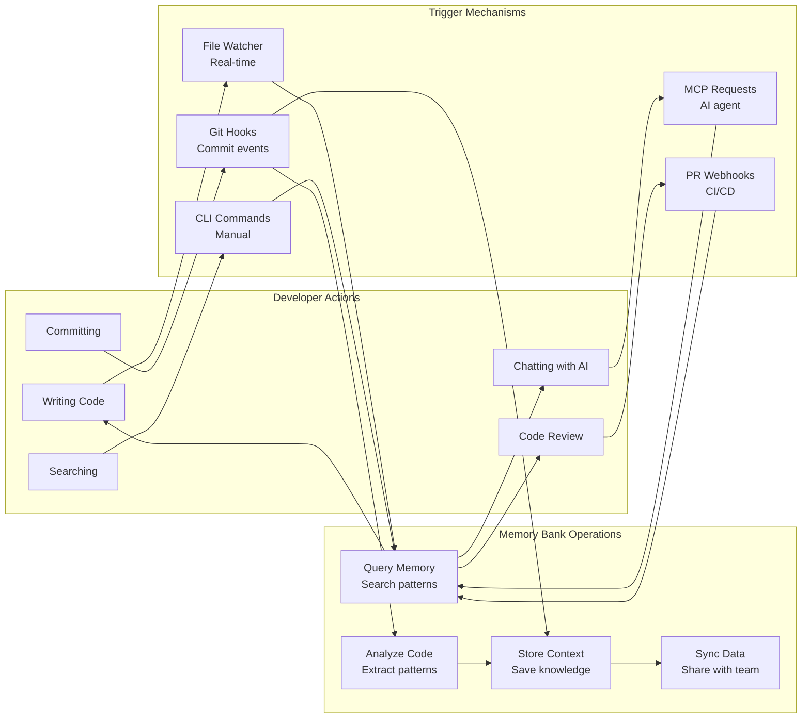

# Joicy Architecture

**Creator:** Denis Tu  
**Date:** December 2025

## Overview

Joicy is a team memory bank system that captures, stores, and shares developer knowledge across teams. It enables AI agents to learn from team history, prevent repeated bugs, and provide context-aware assistance. The system works in both SaaS and air-gapped environments, supporting individual developers, teams, and entire organizations.

## Key Concepts

- **Memory Bank**: A vector database that stores code patterns, bug fixes, solutions, and team knowledge
- **Local Memory**: Per-developer memory bank for fast, personal context
- **Central Memory**: Team/company-wide memory bank for shared knowledge
- **MCP Server**: Model Context Protocol server that provides memory bank access to AI agents
- **Sync Service**: Background service that synchronizes local memory with central memory

## System Overview

This diagram shows the high-level architecture of Joicy, including all major components and their relationships. The system is designed with a local-first approach, where each developer has a local memory bank that syncs with a central memory bank for team knowledge sharing.

## Component Interaction Flow

This sequence diagram illustrates how different components interact during typical developer workflows. It shows the flow from code writing to memory storage, and from manual queries to result retrieval.

## Memory Bank Hierarchy

Joicy uses a hierarchical memory structure that scales from individual developers to entire organizations. Each level syncs knowledge upward while allowing queries across all levels. This enables both personal context (fast, local) and team knowledge (comprehensive, shared).

## Search Performance Architecture

To handle large memory banks efficiently, Joicy uses a three-tier caching strategy:
- **Hot Cache**: In-memory cache for recent, frequently accessed patterns (<10ms)
- **Warm Index**: Fast vector search on recent data with metadata filtering (50-200ms)
- **Cold Storage**: Full archive search for historical patterns (500ms-2s, async)

This ensures commit-time searches remain fast (<300ms) even as the memory bank grows to millions of entries.

## Deployment Architecture

Joicy supports three deployment models to meet different security and compliance requirements:
- **SaaS**: Cloud-hosted service for teams that want managed infrastructure
- **On-Premise**: Self-hosted deployment for companies with data sovereignty requirements
- **Air-Gapped**: Fully isolated deployment for highly regulated environments

All deployment models use the same client components (CLI, MCP server, VSCode extension), only the backend location changes.

## Data Flow: Commit to Memory Bank

This flowchart shows the complete process when a developer commits code. The system extracts context, analyzes patterns, searches for similar issues, stores new knowledge, and syncs with the central memory bank. This is one of many trigger mechanisms - the memory bank is also queried in real-time during coding, via AI agents, and through manual searches.

## Product Components

Joicy is delivered as multiple components that work together:
- **CLI Tool**: Primary interface for developers (Rust binary)
- **MCP Server**: Embedded server that provides memory bank access to AI agents
- **VSCode Extension**: Optional UI for enhanced developer experience
- **Docker Image**: For enterprise self-hosted deployments

All components can be installed via package managers, marketplaces, or manual download.

## Scaling Strategy

Joicy scales from small teams to large enterprises:
- **Small Teams**: Single instance handles both local and central memory
- **Medium Teams**: Distributed architecture with team-level memory banks
- **Large Enterprises**: Multi-tier architecture with sharding, clustering, and CDN caching

The architecture grows with the organization without requiring major changes.

## Use Cases & Trigger Mechanisms

Joicy is not limited to git hooks - it provides value across multiple use cases:

**Real-Time Use Cases**: Memory bank is queried continuously as developers code, providing instant suggestions and context-aware autocomplete.

**Git-Based Use Cases**: Pre/post-commit hooks analyze code and store context, while PR integration provides review suggestions.

**AI Agent Use Cases**: MCP server enables AI agents to query memory bank during conversations, load team context at session start, and retrieve relevant patterns.

**Manual Use Cases**: Developers can search memory bank via CLI, ask questions through chat interfaces, and generate documentation.

**Onboarding Use Cases**: New developers can query team knowledge, discover similar features, and learn best practices.

**Code Review Use Cases**: PR analysis compares with previous PRs, detects known patterns, and suggests solutions from memory bank.

```mermaid
graph TB
    subgraph "Real-Time Use Cases"
        RT1[While Coding<br/>AI agent queries memory<br/>as developer types]
        RT2[IDE Suggestions<br/>Inline code suggestions<br/>based on team patterns]
        RT3[Autocomplete<br/>Context-aware completions<br/>from memory bank]
    end

    subgraph "Git-Based Use Cases"
        GIT1[Pre-Commit Hook<br/>Detect known bugs<br/>before commit]
        GIT2[Post-Commit Hook<br/>Store code context<br/>after commit]
        GIT3[PR/MR Integration<br/>Review suggestions<br/>based on history]
    end

    subgraph "AI Agent Use Cases"
        AI1[MCP Server Queries<br/>AI agent asks for context<br/>during conversation]
        AI2[Memory Initialization<br/>Load team knowledge<br/>at session start]
        AI3[Context Retrieval<br/>Fetch relevant patterns<br/>for current task]
    end

    subgraph "Manual Use Cases"
        MAN1[CLI Search<br/>Developer searches<br/>via joicy search command]
        MAN2[Chat Interface<br/>Ask questions about<br/>codebase patterns]
        MAN3[Documentation<br/>Generate docs from<br/>memory bank knowledge]
    end

    subgraph "Onboarding Use Cases"
        ONB1[New Developer<br/>Query team knowledge<br/>about project]
        ONB2[Feature Discovery<br/>Find similar features<br/>and implementations]
        ONB3[Best Practices<br/>Learn team patterns<br/>and conventions]
    end

    subgraph "Code Review Use Cases"
        CR1[PR Analysis<br/>Compare with similar<br/>previous PRs]
        CR2[Pattern Detection<br/>Identify known issues<br/>in review]
        CR3[Solution Suggestions<br/>Recommend fixes<br/>from memory bank]
    end

    RT1 --> MEM[Memory Bank]
    RT2 --> MEM
    RT3 --> MEM
    GIT1 --> MEM
    GIT2 --> MEM
    GIT3 --> MEM
    AI1 --> MEM
    AI2 --> MEM
    AI3 --> MEM
    MAN1 --> MEM
    MAN2 --> MEM
    MAN3 --> MEM
    ONB1 --> MEM
    ONB2 --> MEM
    ONB3 --> MEM
    CR1 --> MEM
    CR2 --> MEM
    CR3 --> MEM
```

## Complete Interaction Model

This diagram shows all the ways developers interact with Joicy and how those interactions trigger memory bank operations. The system supports multiple trigger mechanisms (file watching, git hooks, CLI commands, MCP requests, PR webhooks) that all feed into the same memory bank operations (query, store, sync, analyze).

