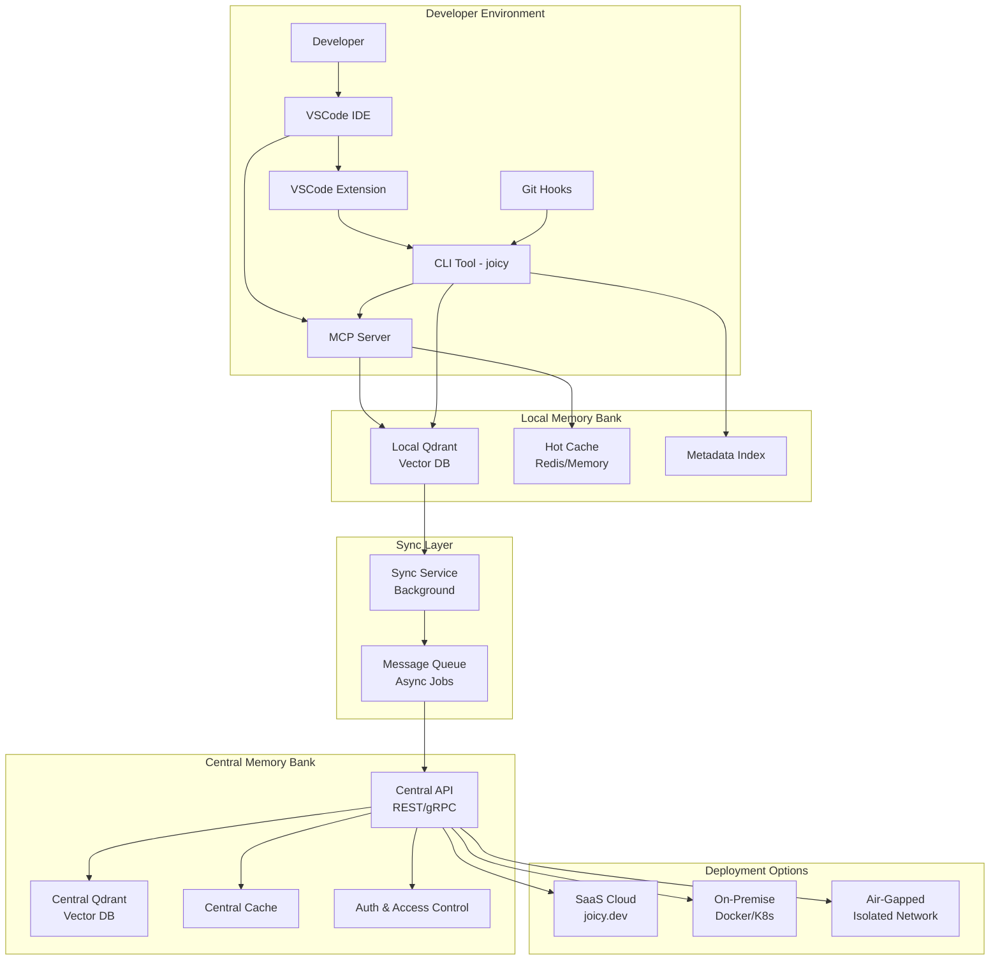
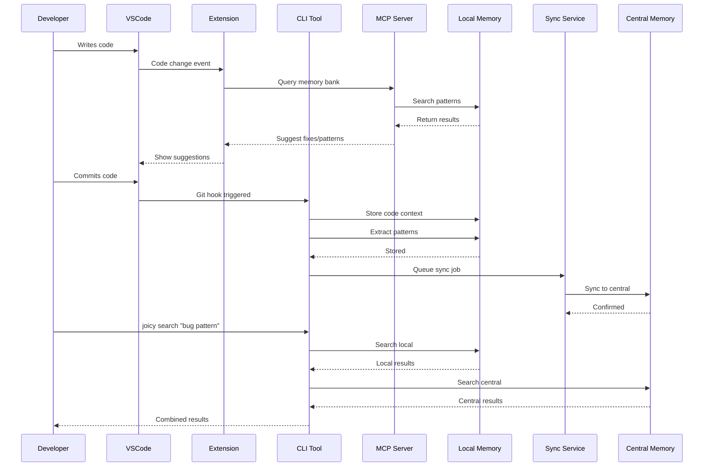
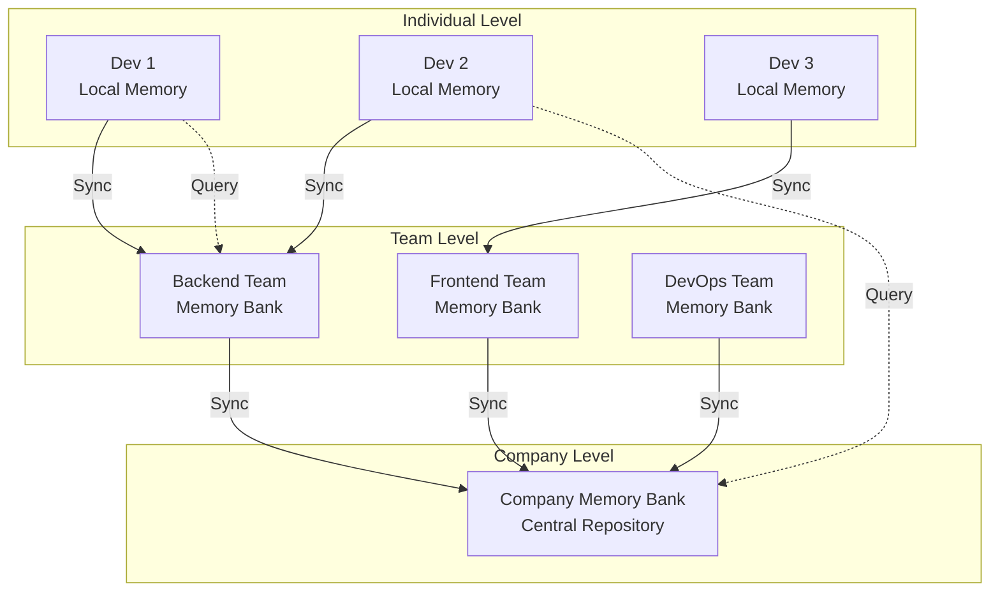
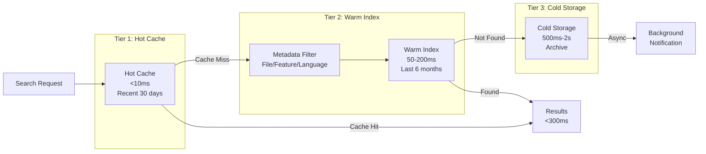
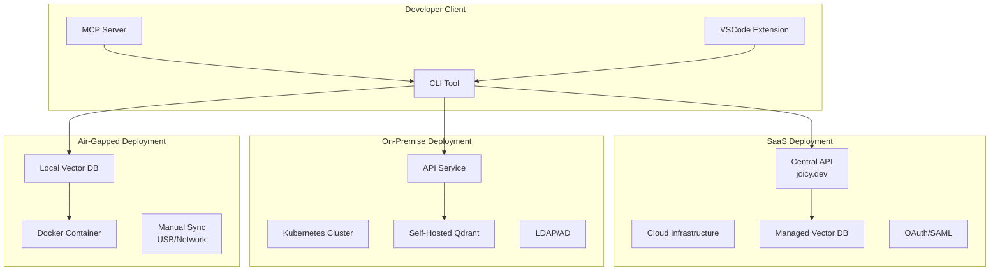
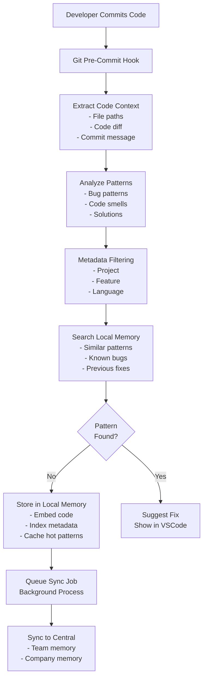
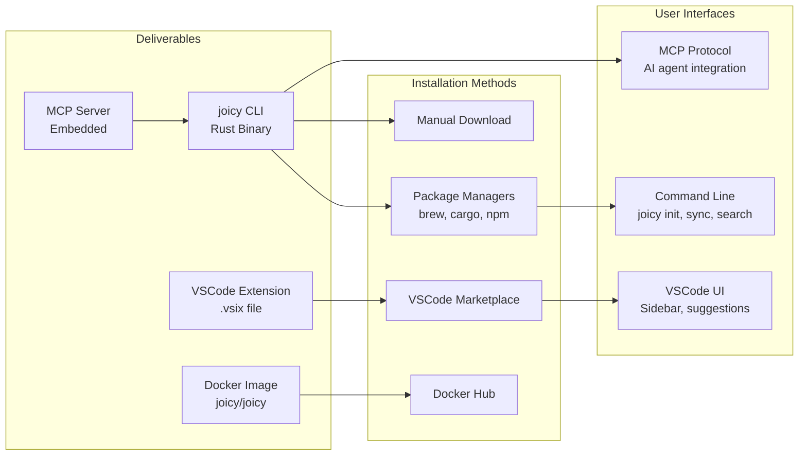
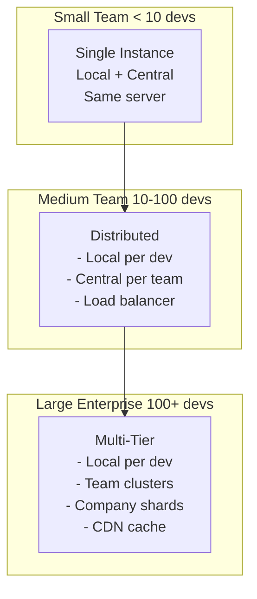
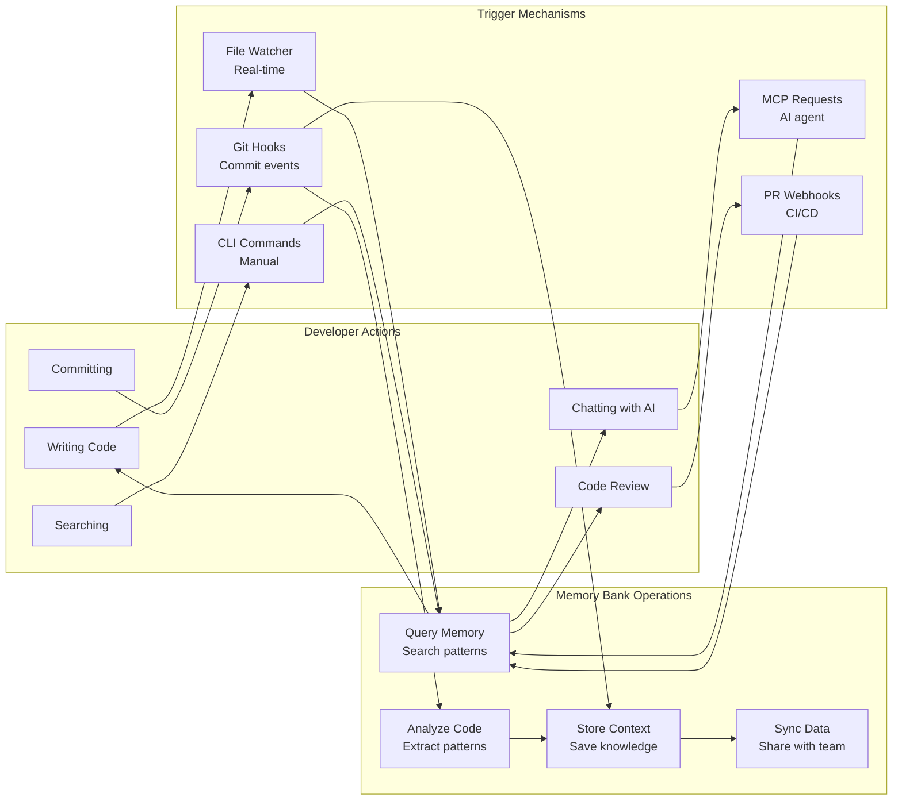

```mermaid
graph TB
    subgraph "Real-Time Use Cases"
        RT1[While Coding<br/>AI agent queries memory<br/>as developer types]
        RT2[IDE Suggestions<br/>Inline code suggestions<br/>based on team patterns]
        RT3[Autocomplete<br/>Context-aware completions<br/>from memory bank]
    end

    subgraph "Git-Based Use Cases"
        GIT1[Pre-Commit Hook<br/>Detect known bugs<br/>before commit]
        GIT2[Post-Commit Hook<br/>Store code context<br/>after commit]
        GIT3[PR/MR Integration<br/>Review suggestions<br/>based on history]
    end

    subgraph "AI Agent Use Cases"
        AI1[MCP Server Queries<br/>AI agent asks for context<br/>during conversation]
        AI2[Memory Initialization<br/>Load team knowledge<br/>at session start]
        AI3[Context Retrieval<br/>Fetch relevant patterns<br/>for current task]
    end

    subgraph "Manual Use Cases"
        MAN1[CLI Search<br/>Developer searches<br/>via joicy search command]
        MAN2[Chat Interface<br/>Ask questions about<br/>codebase patterns]
        MAN3[Documentation<br/>Generate docs from<br/>memory bank knowledge]
    end

    subgraph "Onboarding Use Cases"
        ONB1[New Developer<br/>Query team knowledge<br/>about project]
        ONB2[Feature Discovery<br/>Find similar features<br/>and implementations]
        ONB3[Best Practices<br/>Learn team patterns<br/>and conventions]
    end

    subgraph "Code Review Use Cases"
        CR1[PR Analysis<br/>Compare with similar<br/>previous PRs]
        CR2[Pattern Detection<br/>Identify known issues<br/>in review]
        CR3[Solution Suggestions<br/>Recommend fixes<br/>from memory bank]
    end

    RT1 --> MEM[Memory Bank]
    RT2 --> MEM
    RT3 --> MEM
    GIT1 --> MEM
    GIT2 --> MEM
    GIT3 --> MEM
    AI1 --> MEM
    AI2 --> MEM
    AI3 --> MEM
    MAN1 --> MEM
    MAN2 --> MEM
    MAN3 --> MEM
    ONB1 --> MEM
    ONB2 --> MEM
    ONB3 --> MEM
    CR1 --> MEM
    CR2 --> MEM
    CR3 --> MEM
```

<!-- Improved compatibility of back to top link: See: https://github.com/othneildrew/Best-README-Template/pull/73 -->
<a id="readme-top"></a>

<!-- PROJECT SHIELDS -->
[![Contributors][contributors-shield]][contributors-url]
[![Forks][forks-shield]][forks-url]
[![Stargazers][stars-shield]][stars-url]
[![Issues][issues-shield]][issues-url]
[![MIT License][license-shield]][license-url]
[![Rust][rust-shield]][rust-url]

<!-- PROJECT LOGO -->
<br />
<div align="center">
  <a href="https://github.com/DmarshalTU/Joicy">
    
  </a>

  <h3 align="center">Joicy</h3>

  <p align="center">
    Team Memory Bank System for AI-Assisted Development
    <br />
    <a href="https://github.com/DmarshalTU/Joicy"><strong>Explore the docs »</strong></a>
    <br />
    <br />
    <a href="https://github.com/DmarshalTU/Joicy/issues/new?labels=bug&template=bug-report---.md">Report Bug</a>
    &middot;
    <a href="https://github.com/DmarshalTU/Joicy/issues/new?labels=enhancement&template=feature-request---.md">Request Feature</a>
  </p>
</div>

<!-- TABLE OF CONTENTS -->
<details>
  <summary>Table of Contents</summary>
  <ol>
    <li>
      <a href="#about-the-project">About The Project</a>
      <ul>
        <li><a href="#built-with">Built With</a></li>
      </ul>
    </li>
    <li>
      <a href="#getting-started">Getting Started</a>
      <ul>
        <li><a href="#prerequisites">Prerequisites</a></li>
        <li><a href="#installation">Installation</a></li>
      </ul>
    </li>
    <li><a href="#usage">Usage</a></li>
    <li><a href="#architecture">Architecture</a></li>
    <li><a href="#roadmap">Roadmap</a></li>
    <li><a href="#contributing">Contributing</a></li>
    <li><a href="#license">License</a></li>
    <li><a href="#contact">Contact</a></li>
    <li><a href="#acknowledgments">Acknowledgments</a></li>
  </ol>
</details>

<!-- ABOUT THE PROJECT -->
## About The Project

**Joicy** is a team memory bank system that captures, stores, and shares developer knowledge across teams. It enables AI agents to learn from team history, prevent repeated bugs, and provide context-aware assistance. The system works in both SaaS and air-gapped environments, supporting individual developers, teams, and entire organizations.

### Key Features

- 🧠 **Team Memory Bank**: Vector database storing code patterns, bug fixes, and solutions
- 🔄 **Local-First Architecture**: Fast local memory with optional central sync
- 🤖 **MCP Integration**: Works with Cline, Copilot, and other AI agents
- 🔍 **Intelligent Search**: Semantic search across team knowledge
- 🔒 **Air-Gapped Support**: Works in isolated environments
- 📊 **Multi-Tier Caching**: Hot/Warm/Cold storage for optimal performance

### Key Concepts

- **Memory Bank**: A vector database that stores code patterns, bug fixes, solutions, and team knowledge
- **Local Memory**: Per-developer memory bank for fast, personal context
- **Central Memory**: Team/company-wide memory bank for shared knowledge
- **MCP Server**: Model Context Protocol server that provides memory bank access to AI agents
- **Sync Service**: Background service that synchronizes local memory with central memory

<p align="right">(<a href="#readme-top">back to top</a>)</p>

### Built With

* [![Rust][rust-shield]][rust-url]
* [![Qdrant][qdrant-shield]][qdrant-url]
* [![MCP][mcp-shield]][mcp-url]

<p align="right">(<a href="#readme-top">back to top</a>)</p>

<!-- GETTING STARTED -->
## Getting Started

### Prerequisites

- Rust 1.70+ (for building from source)
- Git (for repository integration)

### Installation

#### From Source

```bash
git clone https://github.com/DmarshalTU/Joicy.git
cd Joicy
cargo build --release
```

#### Using Cargo

```bash
cargo install joicy
```

#### Using Homebrew (macOS)

```bash
brew install joicy
```

### Quick Start

1. Initialize a memory bank in your repository:
   ```bash
   joicy init .
   ```

2. Start using it with your AI agent (Cline, Copilot, etc.)

3. The memory bank will automatically capture code patterns as you work

<p align="right">(<a href="#readme-top">back to top</a>)</p>

<!-- USAGE -->
## Usage

### Initialize Memory Bank

```bash
joicy init /path/to/repository
```

This creates:
- `.joicy/` directory structure
- `config.toml` configuration file
- `memory/` directory for storage

### Search Memory Bank

```bash
joicy search "bug pattern"
joicy search "authentication" --file src/auth.rs
```

### Sync with Central

```bash
joicy sync
joicy sync --force  # Force full sync
```

### Check Status

```bash
joicy status
```

### Clean Old Entries

```bash
joicy clean --days 30
```

### Export Memory Bank

```bash
joicy export
joicy export --output backup.json
```

<p align="right">(<a href="#readme-top">back to top</a>)</p>

<!-- ARCHITECTURE -->
## Architecture

### System Overview

Joicy uses a local-first architecture where each developer has a local memory bank that syncs with a central memory bank for team knowledge sharing.



### Component Interaction Flow

This sequence diagram illustrates how different components interact during typical developer workflows.



### Memory Bank Hierarchy

Joicy uses a hierarchical memory structure that scales from individual developers to entire organizations. Each level syncs knowledge upward while allowing queries across all levels.



### Search Performance Architecture

To handle large memory banks efficiently, Joicy uses a three-tier caching strategy that ensures commit-time searches remain fast (<300ms) even as the memory bank grows to millions of entries.



### Deployment Architecture

Joicy supports three deployment models to meet different security and compliance requirements.



### Data Flow: Commit to Memory Bank

This flowchart shows the complete process when a developer commits code. The system extracts context, analyzes patterns, searches for similar issues, stores new knowledge, and syncs with the central memory bank.



### Product Components

Joicy is delivered as multiple components that work together.



### Scaling Strategy

Joicy scales from small teams to large enterprises without requiring major changes.



### Use Cases & Trigger Mechanisms

Joicy is not limited to git hooks - it provides value across multiple use cases.



### Complete Interaction Model

This diagram shows all the ways developers interact with Joicy and how those interactions trigger memory bank operations.



<p align="right">(<a href="#readme-top">back to top</a>)</p>

<!-- ROADMAP -->
## Roadmap

See [ROADMAP.md](ROADMAP.md) for detailed development plan.

### Phase 0: Foundation & MVP (Current)
- [x] Project structure with feature flags
- [x] CLI tool with `init` command
- [x] Configuration management
- [ ] Local memory bank storage
- [ ] Git integration
- [ ] Basic MCP server

### Phase 1: Core Features
- [ ] Vector database integration (Qdrant)
- [ ] Caching layer
- [ ] Search functionality
- [ ] Status and management commands

### Phase 2: Team Features
- [ ] Central memory bank API
- [ ] Sync service
- [ ] Team management

### Phase 3: Enterprise Features
- [ ] Self-hosted deployment
- [ ] Air-gapped support
- [ ] Enterprise authentication
- [ ] VSCode extension

See the [open issues](https://github.com/DmarshalTU/Joicy/issues) for a full list of proposed features (and known issues).

<p align="right">(<a href="#readme-top">back to top</a>)</p>

<!-- CONTRIBUTING -->
## Contributing

Contributions are what make the open source community such an amazing place to learn, inspire, and create. Any contributions you make are **greatly appreciated**.

If you have a suggestion that would make this better, please fork the repo and create a pull request. You can also simply open an issue with the tag "enhancement".
Don't forget to give the project a star! Thanks again!

1. Fork the Project
2. Create your Feature Branch (`git checkout -b feature/AmazingFeature`)
3. Commit your Changes (`git commit -m 'Add some AmazingFeature'`)
4. Push to the Branch (`git push origin feature/AmazingFeature`)
5. Open a Pull Request

<p align="right">(<a href="#readme-top">back to top</a>)</p>

<!-- LICENSE -->
## License

This project is dual-licensed:

- **Non-Commercial Use**: Free and open source with attribution required
- **Commercial Use**: Requires a separate commercial license

See `LICENSE.txt` for full details. For commercial licensing inquiries, contact dmarshaltu@gmail.com

<p align="right">(<a href="#readme-top">back to top</a>)</p>

<!-- CONTACT -->
## Contact

Denis Tu -  dmarshaltu@gmail.com

Project Link: [https://github.com/DmarshalTU/Joicy](https://github.com/DmarshalTU/Joicy)

<p align="right">(<a href="#readme-top">back to top</a>)</p>

<!-- ACKNOWLEDGMENTS -->
## Acknowledgments

* [Best-README-Template](https://github.com/othneildrew/Best-README-Template)
* [Cline](https://github.com/Anthropic-ai/cline) - Inspiration for MCP integration
* [Qdrant](https://qdrant.tech/) - Vector database
* [MCP Protocol](https://modelcontextprotocol.io/) - Model Context Protocol

<p align="right">(<a href="#readme-top">back to top</a>)</p>

<!-- MARKDOWN LINKS & IMAGES -->
<!-- https://www.markdownguide.org/basic-syntax/#reference-style-links -->
[contributors-shield]: https://img.shields.io/github/contributors/DmarshalTU/Joicy.svg?style=for-the-badge
[contributors-url]: https://github.com/DmarshalTU/Joicy/graphs/contributors
[forks-shield]: https://img.shields.io/github/forks/DmarshalTU/Joicy.svg?style=for-the-badge
[forks-url]: https://github.com/DmarshalTU/Joicy/network/members
[stars-shield]: https://img.shields.io/github/stars/DmarshalTU/Joicy.svg?style=for-the-badge
[stars-url]: https://github.com/DmarshalTU/Joicy/stargazers
[issues-shield]: https://img.shields.io/github/issues/DmarshalTU/Joicy.svg?style=for-the-badge
[issues-url]: https://github.com/DmarshalTU/Joicy/issues
[license-shield]: https://img.shields.io/github/license/DmarshalTU/Joicy.svg?style=for-the-badge
[license-url]: https://github.com/DmarshalTU/Joicy/blob/main/LICENSE.txt
[rust-shield]: https://img.shields.io/badge/Rust-000000?style=for-the-badge&logo=rust&logoColor=white
[rust-url]: https://www.rust-lang.org/
[qdrant-shield]: https://img.shields.io/badge/Qdrant-000000?style=for-the-badge&logo=qdrant&logoColor=white
[qdrant-url]: https://qdrant.tech/
[mcp-shield]: https://img.shields.io/badge/MCP-000000?style=for-the-badge
[mcp-url]: https://modelcontextprotocol.io/
